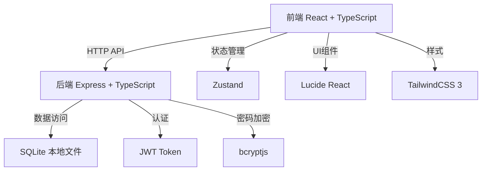
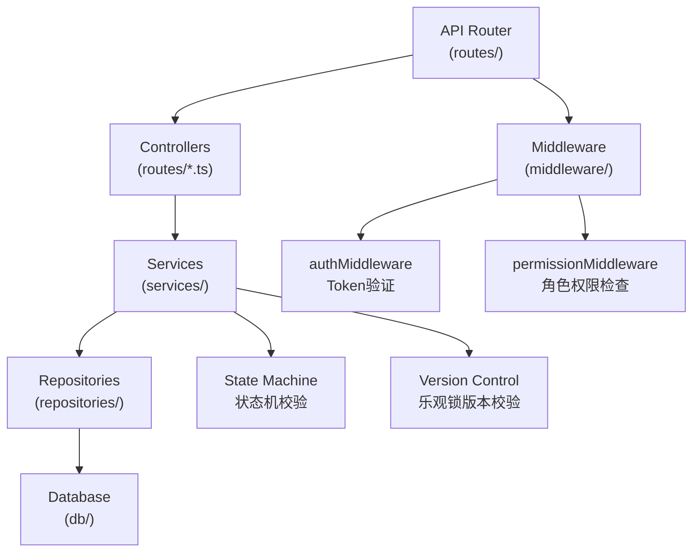
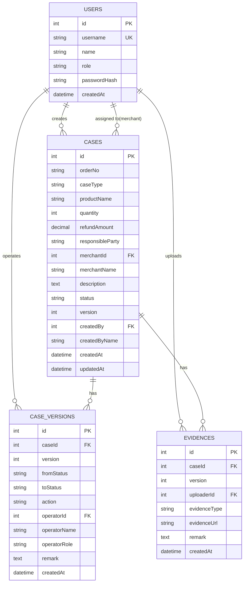

## 1. 架构设计



## 2. 技术描述

- **前端**：React@18 + TypeScript@5 + Vite@6 + TailwindCSS@3 + Zustand@5 + React Router@7 + Lucide React@0.511
- **后端**：Express@4 + TypeScript@5 + better-sqlite3@12
- **数据库**：SQLite 3（本地文件存储，data/database.sqlite）
- **认证**：jsonwebtoken@9 + bcryptjs@3
- **开发工具**：concurrently（前后端并行启动）、nodemon（后端热重载）

## 3. 路由定义

| 前端路由 | 页面 | 说明 |
|----------|------|------|
| `/login` | 登录页 | 公开访问 |
| `/cases` | 案件列表页 | 需登录，默认首页 |
| `/cases/:id` | 案件详情页 | 需登录 |
| `/cases/new` | 新建申请页 | 需登录，仅团长可访问 |
| `/export` | 退款导出页 | 需登录，仅客服可访问 |
| `*` | 404重定向 | 重定向到 `/cases` 或 `/login` |

## 4. API 定义

### 4.1 基础路径
所有 API 路径前缀：`/api`

### 4.2 类型定义

```typescript
// 共享类型定义 (shared/types.ts)

type UserRole = 'leader' | 'merchant' | 'cs';

type CaseType = 'outOfStock' | 'damaged' | 'wrongDelivery';

type CaseStatus = 
  | 'pendingEvidence' 
  | 'merchantProcessing' 
  | 'csArbitration' 
  | 'refundCompleted' 
  | 'rejected';

type ResponsibleParty = 'merchant' | 'logistics' | 'platform';

type CaseAction = 
  | 'submitEvidence' 
  | 'merchantRespond' 
  | 'csRefund' 
  | 'csReject';

interface User {
  id: number;
  username: string;
  name: string;
  role: UserRole;
  passwordHash: string;
  createdAt: string;
}

interface Case {
  id: number;
  orderNo: string;
  caseType: CaseType;
  productName: string;
  quantity: number;
  refundAmount: number;
  responsibleParty: ResponsibleParty;
  merchantId: number;
  merchantName: string;
  description: string;
  status: CaseStatus;
  version: number;
  createdBy: number;
  createdByName: string;
  createdAt: string;
  updatedAt: string;
}

interface CaseVersion {
  id: number;
  caseId: number;
  version: number;
  fromStatus: CaseStatus | null;
  toStatus: CaseStatus;
  action: CaseAction | 'create';
  operatorId: number;
  operatorName: string;
  operatorRole: UserRole;
  remark: string;
  createdAt: string;
}

interface Evidence {
  id: number;
  caseId: number;
  version: number;
  uploaderId: number;
  evidenceType: 'image' | 'video' | 'other';
  evidenceUrl: string;
  remark: string;
  createdAt: string;
}

interface ApiResponse<T> {
  success: boolean;
  data?: T;
  error?: {
    code: string;
    message: string;
  };
}

// 请求类型
interface LoginRequest {
  username: string;
  password: string;
}

interface LoginResponse {
  token: string;
  user: Omit<User, 'passwordHash'>;
}

interface CreateCaseRequest {
  orderNo: string;
  caseType: CaseType;
  productName: string;
  quantity: number;
  refundAmount: number;
  responsibleParty: ResponsibleParty;
  merchantId: number;
  description: string;
}

interface CaseActionRequest {
  action: CaseAction;
  version: number;
  remark: string;
  evidenceType?: 'image' | 'video' | 'other';
  evidenceUrl?: string;
}
```

### 4.3 认证接口

| 方法 | 路径 | 说明 | 权限 |
|------|------|------|------|
| POST | `/auth/login` | 登录获取token | 公开 |
| POST | `/auth/logout` | 登出 | 已登录 |

### 4.4 案件管理接口

| 方法 | 路径 | 说明 | 权限 |
|------|------|------|------|
| GET | `/cases` | 获取案件列表（支持筛选） | 已登录 |
| GET | `/cases/:id` | 获取案件详情（含版本历史和凭证） | 已登录 |
| POST | `/cases` | 创建售后申请 | 团长 |
| POST | `/cases/:id/action` | 执行案件操作 | 对应角色 |
| GET | `/cases/merchants` | 获取商家列表 | 已登录 |

### 4.5 导出接口

| 方法 | 路径 | 说明 | 权限 |
|------|------|------|------|
| GET | `/export/refunds` | 导出退款清单CSV | 客服 |

### 4.6 错误码定义

| 错误码 | 说明 |
|--------|------|
| `UNAUTHORIZED` | 未登录或Token无效 |
| `PERMISSION_DENIED` | 无权限执行此操作 |
| `INVALID_PARAMS` | 参数校验失败 |
| `CASE_NOT_FOUND` | 案件不存在 |
| `VERSION_CONFLICT` | 案件版本不匹配 |
| `INVALID_STATUS_TRANSITION` | 非法状态流转 |
| `MISSING_EVIDENCE` | 缺少凭证URL |
| `SERVER_ERROR` | 服务器内部错误 |

## 5. 服务器架构



### 5.1 目录结构

```
api/
├── db/
│   ├── index.ts           # 数据库连接和初始化
│   └── schema.ts          # 建表SQL和初始数据
├── repositories/
│   ├── userRepository.ts  # 用户数据访问
│   ├── caseRepository.ts  # 案件数据访问
│   └── exportRepository.ts # 导出数据访问
├── services/
│   ├── authService.ts     # 认证业务逻辑
│   ├── caseService.ts     # 案件业务逻辑（状态机+版本控制）
│   └── exportService.ts   # 导出业务逻辑
├── middleware/
│   ├── auth.ts            # Token认证中间件
│   └── permission.ts      # 权限检查中间件
├── routes/
│   ├── auth.ts            # 认证路由
│   ├── cases.ts           # 案件路由
│   └── export.ts          # 导出路由
├── app.ts                 # Express应用配置
└── server.ts              # 服务器启动
```

## 6. 数据模型

### 6.1 ER 图



### 6.2 DDL 语句

```sql
-- 用户表
CREATE TABLE IF NOT EXISTS users (
  id INTEGER PRIMARY KEY AUTOINCREMENT,
  username TEXT UNIQUE NOT NULL,
  name TEXT NOT NULL,
  role TEXT NOT NULL CHECK(role IN ('leader', 'merchant', 'cs')),
  passwordHash TEXT NOT NULL,
  createdAt DATETIME DEFAULT CURRENT_TIMESTAMP
);

-- 案件表
CREATE TABLE IF NOT EXISTS cases (
  id INTEGER PRIMARY KEY AUTOINCREMENT,
  orderNo TEXT NOT NULL,
  caseType TEXT NOT NULL CHECK(caseType IN ('outOfStock', 'damaged', 'wrongDelivery')),
  productName TEXT NOT NULL,
  quantity INTEGER NOT NULL,
  refundAmount DECIMAL(10,2) NOT NULL,
  responsibleParty TEXT NOT NULL CHECK(responsibleParty IN ('merchant', 'logistics', 'platform')),
  merchantId INTEGER NOT NULL,
  merchantName TEXT NOT NULL,
  description TEXT NOT NULL,
  status TEXT NOT NULL DEFAULT 'pendingEvidence' 
    CHECK(status IN ('pendingEvidence', 'merchantProcessing', 'csArbitration', 'refundCompleted', 'rejected')),
  version INTEGER NOT NULL DEFAULT 1,
  createdBy INTEGER NOT NULL,
  createdByName TEXT NOT NULL,
  createdAt DATETIME DEFAULT CURRENT_TIMESTAMP,
  updatedAt DATETIME DEFAULT CURRENT_TIMESTAMP,
  FOREIGN KEY (merchantId) REFERENCES users(id),
  FOREIGN KEY (createdBy) REFERENCES users(id)
);

-- 版本历史表
CREATE TABLE IF NOT EXISTS case_versions (
  id INTEGER PRIMARY KEY AUTOINCREMENT,
  caseId INTEGER NOT NULL,
  version INTEGER NOT NULL,
  fromStatus TEXT,
  toStatus TEXT NOT NULL,
  action TEXT NOT NULL,
  operatorId INTEGER NOT NULL,
  operatorName TEXT NOT NULL,
  operatorRole TEXT NOT NULL,
  remark TEXT,
  createdAt DATETIME DEFAULT CURRENT_TIMESTAMP,
  FOREIGN KEY (caseId) REFERENCES cases(id),
  FOREIGN KEY (operatorId) REFERENCES users(id)
);

-- 凭证表
CREATE TABLE IF NOT EXISTS evidences (
  id INTEGER PRIMARY KEY AUTOINCREMENT,
  caseId INTEGER NOT NULL,
  version INTEGER NOT NULL,
  uploaderId INTEGER NOT NULL,
  evidenceType TEXT NOT NULL CHECK(evidenceType IN ('image', 'video', 'other')),
  evidenceUrl TEXT NOT NULL,
  remark TEXT,
  createdAt DATETIME DEFAULT CURRENT_TIMESTAMP,
  FOREIGN KEY (caseId) REFERENCES cases(id),
  FOREIGN KEY (uploaderId) REFERENCES users(id)
);

-- 索引
CREATE INDEX IF NOT EXISTS idx_cases_status ON cases(status);
CREATE INDEX IF NOT EXISTS idx_cases_type ON cases(caseType);
CREATE INDEX IF NOT EXISTS idx_cases_merchant ON cases(merchantId);
CREATE INDEX IF NOT EXISTS idx_cases_created ON cases(createdBy);
CREATE INDEX IF NOT EXISTS idx_versions_case ON case_versions(caseId);
CREATE INDEX IF NOT EXISTS idx_evidences_case ON evidences(caseId);
```

### 6.3 初始数据

```sql
-- 预置演示用户（密码均为 123456，bcrypt加密）
INSERT OR IGNORE INTO users (username, name, role, passwordHash) VALUES
('leader1', '李团长', 'leader', '$2a$10$...'), -- 团长
('merchant1', '张商家', 'merchant', '$2a$10$...'), -- 商家
('cs1', '王客服', 'cs', '$2a$10$...'); -- 客服
```

### 6.4 状态机规则

```typescript
// 状态流转配置
const stateTransitions: Record<CaseStatus, Array<{
  action: CaseAction;
  role: UserRole;
  targetStatus: CaseStatus;
  requireEvidence: boolean;
}>> = {
  pendingEvidence: [
    {
      action: 'submitEvidence',
      role: 'leader',
      targetStatus: 'merchantProcessing',
      requireEvidence: true
    }
  ],
  merchantProcessing: [
    {
      action: 'merchantRespond',
      role: 'merchant',
      targetStatus: 'csArbitration',
      requireEvidence: false
    }
  ],
  csArbitration: [
    {
      action: 'csRefund',
      role: 'cs',
      targetStatus: 'refundCompleted',
      requireEvidence: false
    },
    {
      action: 'csReject',
      role: 'cs',
      targetStatus: 'rejected',
      requireEvidence: false
    }
  ],
  refundCompleted: [], // 终态
  rejected: [] // 终态
};
```
