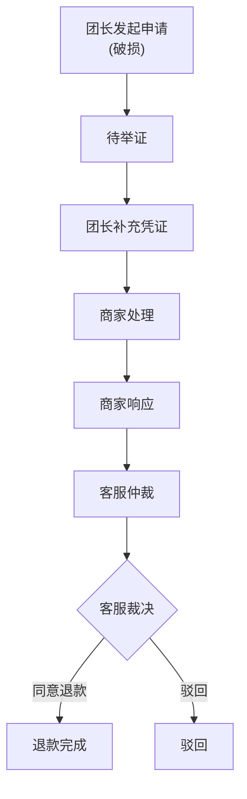

## 1. 产品概述

社区团购售后仲裁系统是面向团长、商家、客服三类角色的售后管理平台，解决社区团购场景下的售后纠纷处理问题。系统通过受控的状态流转机制和完整的审计追踪，确保售后案件处理的公正性和可追溯性。

- 核心价值：规范售后处理流程，明确各方责任，提供完整审计记录
- 目标用户：社区团购团长、入驻商家、平台客服
- 市场价值：提升售后处理效率，减少纠纷，增强平台公信力

## 2. 核心功能

### 2.1 用户角色

| 角色 | 注册方式 | 核心权限 |
|------|----------|----------|
| 团长 | 系统预置 | 发起售后申请、补充凭证、查看案件 |
| 商家 | 系统预置 | 查看分配的案件、响应处理、上传凭证 |
| 客服 | 系统预置 | 仲裁裁决（同意退款/驳回）、导出退款清单、查看所有案件 |

### 2.2 功能模块

1. **登录页**：角色登录、身份验证、Token管理
2. **案件列表页**：多维度筛选（类型/状态/责任方）、关键词搜索、案件卡片展示
3. **案件详情页**：案件信息展示、版本历史、凭证列表、操作区域
4. **新建申请页**：售后申请表单、类型选择、责任方指定
5. **退款导出页**：日期筛选、退款清单查询、CSV导出

### 2.3 页面详情

| 页面名称 | 模块名称 | 功能描述 |
|----------|----------|----------|
| 登录页 | 登录表单 | 用户名密码登录、角色自动识别、错误提示 |
| 案件列表页 | 筛选区域 | 售后类型筛选（缺货/破损/错发）、状态筛选、责任方筛选、关键词搜索 |
| 案件列表页 | 案件卡片 | 订单号、状态标签、类型标签、金额、时间、操作按钮 |
| 案件详情页 | 基本信息 | 订单号、商品信息、金额、责任方、商家 |
| 案件详情页 | 版本历史 | 时间线展示每步操作（操作人、备注、时间、版本号） |
| 案件详情页 | 凭证列表 | 展示所有上传的凭证（类型、URL、上传人、时间） |
| 案件详情页 | 操作区域 | 根据当前状态和角色显示可执行操作 |
| 新建申请页 | 申请表单 | 订单号、售后类型、商品名称、数量、金额、责任方、商家、问题描述 |
| 退款导出页 | 查询区域 | 日期范围选择、查询按钮 |
| 退款导出页 | 退款列表 | 展示符合条件的退款案件 |
| 退款导出页 | 导出按钮 | 导出CSV格式退款清单 |

## 3. 核心流程

### 3.1 正常流程（破损退款）

团长发起售后申请 → 待举证 → 团长补充凭证 → 商家处理 → 商家响应 → 客服仲裁 → 客服裁决 → 退款完成

### 3.2 状态流转规则

| 当前状态 | 可执行操作 | 操作角色 | 目标状态 |
|----------|------------|----------|----------|
| 待举证 | 提交凭证 | 团长 | 商家处理 |
| 商家处理 | 商家响应 | 商家 | 客服仲裁 |
| 客服仲裁 | 同意退款 | 客服 | 退款完成 |
| 客服仲裁 | 驳回 | 客服 | 驳回 |
| 退款完成 | - | - | 终态 |
| 驳回 | - | - | 终态 |

### 3.3 失败链路

1. **商家越权裁决**：商家尝试执行客服仲裁操作 → 权限错误
2. **缺少凭证提交**：团长提交凭证时未提供凭证URL → 参数错误
3. **旧版本重复处理**：使用旧版本号提交操作 → 版本冲突

## 4. 用户界面设计

### 4.1 设计风格

- **主色调**：深蓝色系（#1e40af），代表专业和信任
- **辅助色**：
  - 成功：绿色（#059669）
  - 警告：橙色（#d97706）
  - 错误：红色（#dc2626）
  - 信息：蓝色（#2563eb）
- **中性色**：Zinc色系（#fafafa 到 #18181b）
- **按钮风格**：圆角8px，悬停时阴影加深，点击时缩放效果
- **字体**：系统字体栈，标题使用较粗字重，正文清晰可读
- **布局风格**：左侧导航栏 + 右侧内容区，卡片式布局
- **图标**：Lucide React 图标库，统一线条风格

### 4.2 页面设计概述

| 页面名称 | 模块名称 | UI 元素 |
|----------|----------|----------|
| 登录页 | 登录表单 | 居中卡片布局、渐变背景、输入框带图标、登录按钮动效 |
| 案件列表页 | 顶部导航 | 左侧Logo、中间标题、右侧用户信息和退出 |
| 案件列表页 | 左侧菜单 | 图标+文字，当前页高亮，悬停效果 |
| 案件列表页 | 筛选区域 | 行内排列的下拉选择器和搜索框 |
| 案件列表页 | 案件卡片 | 网格布局，状态标签使用不同颜色 |
| 案件详情页 | 时间线 | 垂直时间线，连接各版本节点 |
| 案件详情页 | 凭证列表 | 表格展示，支持点击预览 |
| 案件详情页 | 操作按钮 | 主按钮突出显示，禁用状态样式区分 |
| 新建申请页 | 表单 | 分组标签，必填项标记，实时验证 |
| 退款导出页 | 数据表格 | 斑马纹，固定表头，可滚动 |

### 4.3 响应式设计

- 桌面端优先设计（≥1280px）
- 平板端（≥768px）：左侧菜单折叠为图标模式
- 移动端（<768px）：菜单改为抽屉式，卡片改为单列布局

### 4.4 动效设计

- 页面加载：元素淡入，列表项错峰出现
- 状态变更：高亮闪烁效果提示更新
- 按钮交互：悬停时背景色渐变，点击时轻微缩放
- 表单验证：错误提示滑入动画
- 模态框：缩放+淡入效果
